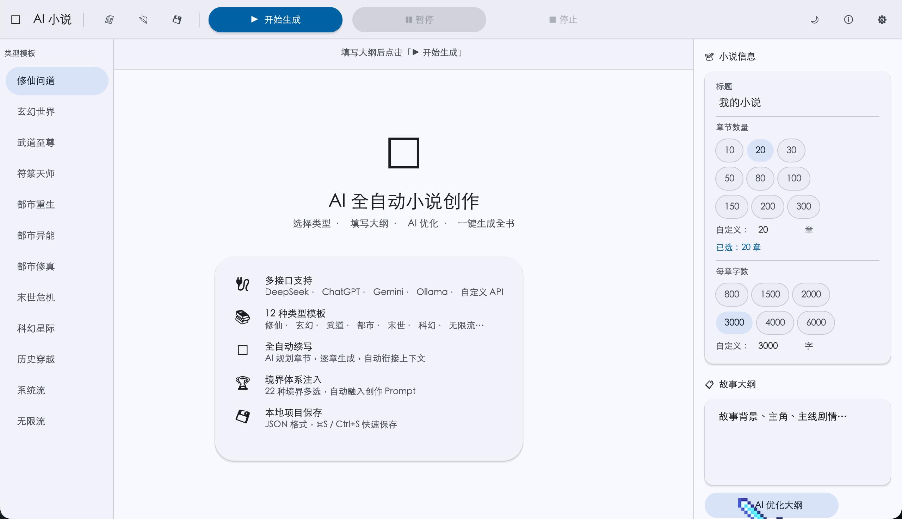
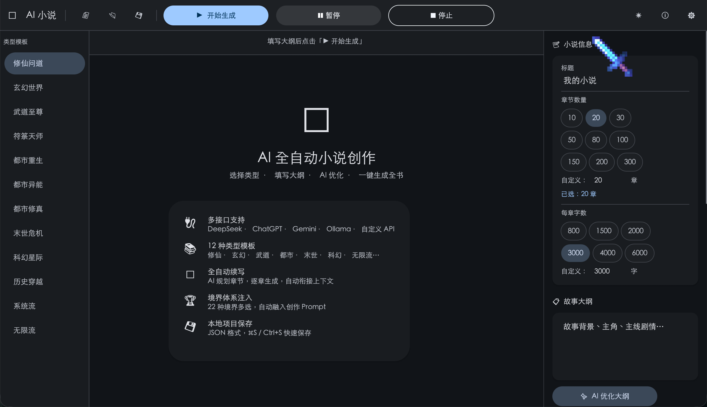

# AI 小说创作工具

> 基于 AI 的全自动长篇小说生成工具，支持多种类型模板、境界体系注入、逐章实时流式输出。

<!-- 主截图：建议放一张完整主界面截图，宽度 800px 左右 -->
<p align="center">
  
</p>

---

## 功能特性

- **多 AI 接口支持** — DeepSeek、ChatGPT、Gemini、Ollama、自定义 API，一键切换
- **12 种类型模板** — 修仙、玄幻、武道、都市、末世、科幻、系统流、无限流等
- **全自动续写** — AI 规划章节大纲，逐章生成，自动衔接上下文
- **22 种境界体系** — 多选注入创作 Prompt，也支持自定义境界
- **章节数量自由选择** — 预设 10 ～ 300 章，支持自定义
- **自定义背景图** — 支持 URL 链接或本地图片
- **亮色 / 暗色模式** — Material Design 3 配色
- **本地项目保存** — JSON 格式，`⌘S` / `Ctrl+S` 快速保存，支持导出 TXT

---

## 界面预览

<p align="center">
  
</p>

---

## 下载

| 平台 | 文件 |
|------|------|
| macOS (Apple Silicon / Intel) | `AI小说创作工具.app` |
| Windows x64 | `novel_ai.exe` |

> macOS 首次打开若提示「无法验证开发者」，右键点击 → **打开** → **打开** 即可。

---

## 快速开始

### 1. 配置 API

首次启动会自动打开设置面板，填入你的 API Key：

| 提供商 | Base URL |
|--------|----------|
| DeepSeek | `https://api.deepseek.com/v1` |
| OpenAI | `https://api.openai.com/v1` |
| Gemini | `https://generativelanguage.googleapis.com/v1beta/openai` |
| Ollama（本地）| `http://localhost:11434/v1` |
| 自定义 | 填入你的接口地址 |

### 2. 创建小说

1. 左侧选择 **类型模板**（如修仙问道、玄幻世界）
2. 右侧填写 **标题**、**章节数量**、**每章字数**
3. 填写 **故事大纲**（主角、背景、主线）
4. 点击「✨ AI 优化大纲」让 AI 完善大纲（可选）
5. 选择 **境界体系**（可多选，自动融入 Prompt）
6. 点击「▶ 开始生成」— AI 自动规划并逐章写作

### 3. 快捷键

| 快捷键 | 功能 |
|--------|------|
| `⌘S` / `Ctrl+S` | 保存项目 |

---

## 从源码构建

**环境要求：** Rust 1.75+

```bash
git clone https://github.com/Ethan13322836698/novel-ai-tool
cd novel-ai-tool
cargo build --release
```

**macOS 打包：**

```bash
mkdir -p "AI小说创作工具.app/Contents/MacOS"
mkdir -p "AI小说创作工具.app/Contents/Resources"
cp target/release/novel_ai "AI小说创作工具.app/Contents/MacOS/AI小说创作工具"
cp assets/AppIcon.icns "AI小说创作工具.app/Contents/Resources/AppIcon.icns"
# 复制 Info.plist（见项目根目录）
codesign --force --deep --sign - "AI小说创作工具.app"
```

**Windows 交叉编译（在 macOS 上）：**

```bash
rustup target add x86_64-pc-windows-gnu
brew install mingw-w64
cargo build --release --target x86_64-pc-windows-gnu
# 产物：target/x86_64-pc-windows-gnu/release/novel_ai.exe
```

---

## 技术栈

| | |
|---|---|
| 语言 | Rust |
| UI 框架 | [egui](https://github.com/emilk/egui) / [eframe](https://github.com/emilk/egui/tree/master/crates/eframe) 0.29 |
| 设计规范 | Material Design 3 |
| AI 接口 | OpenAI 兼容 REST API |

---

## License

MIT © [Ethan](https://github.com/Ethan13322836698)
